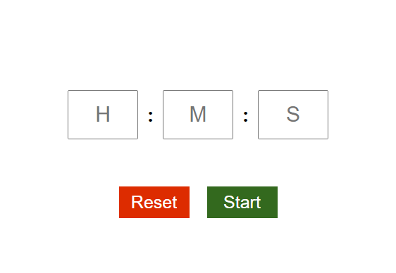

# Countdown Timer
This React application serves as a simple timer with user-friendly functionalities for setting, starting, and resetting the timer.

## Functionalities
### 1. Set Desired Time
Users can set the desired time for the timer by inputting the desired duration.
### 2. Start the Timer
Once the desired time is set, users can start the timer to initiate the countdown.
### 3. Reset the Timer
Users have the option to reset the timer, returning it to the initial state.

## Preview


## Installation

- Pull this branch into your local system.
- Make sure you have Node installed (preferrably Node v18.17.1).
- Navigate to the project directory and run 
  ```
  npm install
  ```
- Once all the dependencies have been installed, run the following command to start the dev server.
  ```
  npm run dev
  ```